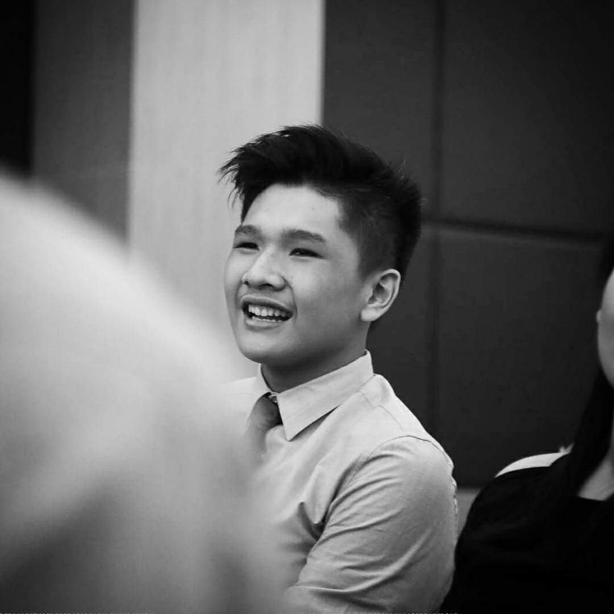

# Joseph Christopher Priyanto's User Page


Let me introduce myself, my name is Joseph Christopher Priyanto



## Who am I as a person?

I am just your typical guy who enjoys simple things. I don't like to overthink and I would dispose everything that is not important. I can set my priorities straight, and this is why I tend to complete all my task. My favorite quote comes from a popular animated movie:

> Yesterday is history, tommorow is a mystery, and today is a gift. That is why it is called present.

## Who am I as a programmer?

As a programmer, I aspire to be a Software Engineer that could create new things that would benefit the people in need. In other words, people who lack access to the current technology we have, who have disabilities, etc.

My goals currently as a Computer Science major are:
- [] Graduate on time
- [x] Get good grades
- [] Explore and find new experience as a programmer

We all know that the simplest program that every programmer wrote was the *Hello World* program. Here's a reminder of what the code looked like:

```
#include <iostream>
using namespace std;

int main(){

    cout << "Hello World!" << endl;

}
```
To find out my favorite programming language, click [here.](README.md)

Just in case anyone is wondering, I'm active on **[Instagram](https://www.instagram.com/jcpriyanto/)**! Kindly check it out here and follow!

And if anyone is wondering, here are my classes for this quarter:
- CSE 101
- CSE 110
- CSE 130
- EDS 124BR

In case anyone missed anything, here are links to the sections:
1. [Top Page](#joseph-christopher-priyantos-user-page)
2. [Who am I as a person?](#who-am-i-as-a-person)
3. [Who am I as a programmer?](#who-am-i-as-a-programmer)
